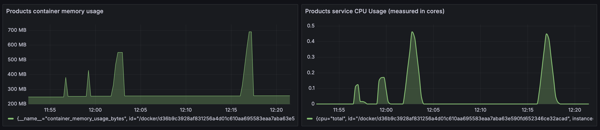
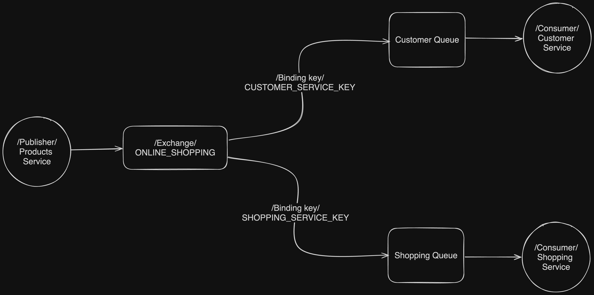
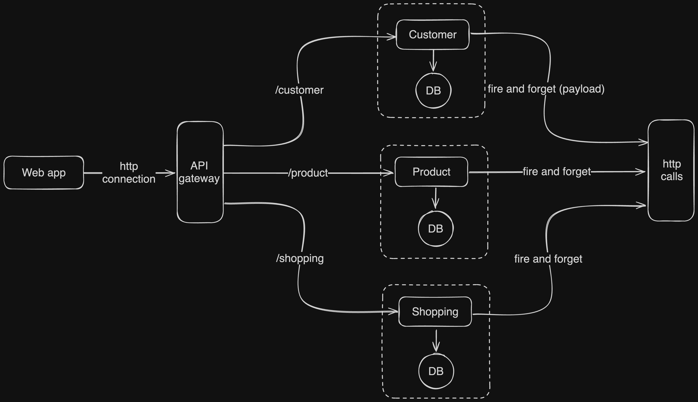

This is a Shop microservice app currently being developed to learn and practise **RabbitMQ** and microservices as a whole.  
I have implemented the **Pub/Sub** pattern associated with RabbitMQ.  
I am using **Node.js**, **Typescript**, **Express**, **SQL** & **Sequelize** for the development. I use migrations for the DBs as well.  
Also, I have **Dockerised** the app and implemented **NGINX** for reverse proxy.

I have done a simple performance test for Products service for demo purposes using **k6** and
I have set up monitoring with **Grafana**, **Prometheus** and **cAdvisor**, allowing for quick identification and resolution of any issues.

## Products Service Grafana Dashboard with example load testing with k6

## Current RabbitMQ setup

## This was the initial setup - events and HTTP calls through a gateway

Some TODOs: **authentication** (OAuth) & **validation**;Redis Caching; CI/CD; Rate Limiting; Security; Swagger; Documentation
